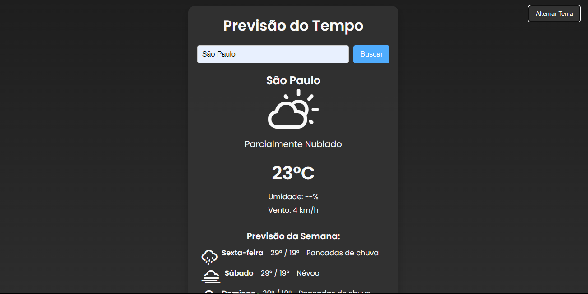

# 🌤️ Aplicação de Previsão do Tempo  

Este projeto é uma aplicação web que exibe a previsão do tempo de qualquer cidade utilizando uma **API de previsão do tempo**. A interface é moderna, responsiva e conta com **modo claro/escuro** para melhor experiência do usuário.  

## 🔥 Funcionalidades  

✅ Busca por cidade para exibir a previsão do tempo  
✅ Exibição de temperatura, umidade e velocidade do vento  
✅ Ícones representando as condições climáticas  
✅ Previsão detalhada para os próximos dias  
✅ Alternância entre modo claro e escuro  

## 🖼️ Screenshot  

  

## 🚀 Tecnologias Utilizadas  

- **HTML, CSS e JavaScript** para a estrutura e interatividade  
- **API Open-Meteo** para obter dados climáticos  
- **Design responsivo e acessível**  

## ⚡ Como Executar  

Você pode acessar a aplicação diretamente pelo link:  

🔗 **[Clima Tempo API](https://clima-tempo-api.netlify.app)**  

Ou, se preferir rodar localmente:  

1. Clone este repositório:  
   ```bash
   git clone https://github.com/seu-usuario/nome-do-repositorio.git
